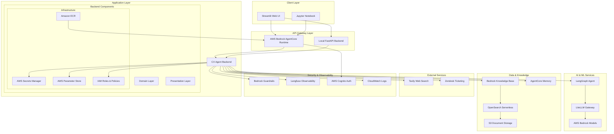
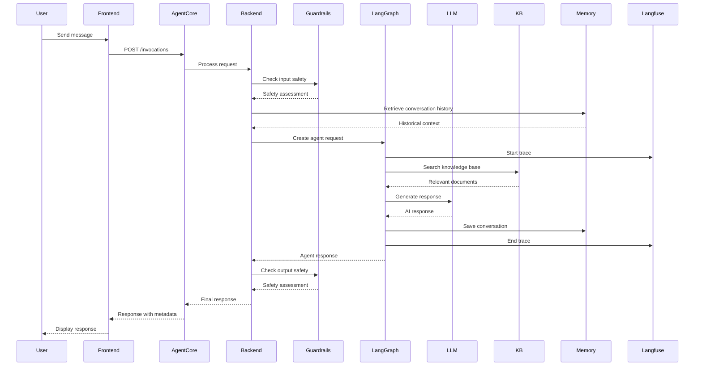

# System Architecture

## System Overview

The Agentic AI Customer Experience Platform is a cloud-native, microservices-based system built on AWS that provides intelligent customer service through conversational AI. The system follows Clean Architecture principles with clear separation between domain logic, infrastructure concerns, and presentation layers.

## Architecture Diagram

## Component Descriptions

### Client Layer Components

#### Streamlit Web UI (cx-agent-frontend)
- **Purpose**: Interactive web-based chat interface for end users
- **Responsibilities**: 
  - Render conversational UI with message history
  - Support dual backend connectivity (local/cloud)
  - Collect user feedback on agent responses
  - Handle authentication and session management
- **Dependencies**: Backend API, AWS Cognito (for cloud mode)
- **Type**: Application

#### Jupyter Notebook
- **Purpose**: Development and testing interface for direct agent interaction
- **Responsibilities**: 
  - Enable programmatic testing of agent capabilities
  - Support development workflows and debugging
  - Provide code examples for integration
- **Dependencies**: Backend API, AWS SDK
- **Type**: Development Tool

### API Gateway Layer

#### AWS Bedrock AgentCore Runtime
- **Purpose**: Managed serverless runtime for production agent deployment
- **Responsibilities**:
  - Host containerized agent in scalable, managed environment
  - Handle authentication via JWT tokens
  - Provide production-grade reliability and scaling
  - Integrate with AWS observability services
- **Dependencies**: ECR container images, Cognito, IAM roles
- **Type**: Managed Service

#### Local FastAPI Backend
- **Purpose**: Development-time API server for local testing
- **Responsibilities**:
  - Provide same API interface as AgentCore for development
  - Enable rapid iteration and debugging
  - Support local development workflows
- **Dependencies**: CX Agent Backend
- **Type**: Development Server

### Application Layer

#### CX Agent Backend
- **Purpose**: Core intelligent agent processing engine
- **Responsibilities**:
  - Orchestrate conversation flows and agent reasoning
  - Integrate with AI models, knowledge bases, and external services
  - Enforce content safety and security policies
  - Maintain conversation state and context
- **Dependencies**: LangGraph, AWS services, external APIs
- **Type**: Application

### AI & ML Services

#### LiteLLM Gateway
- **Purpose**: Multi-provider AI model gateway with unified API
- **Responsibilities**:
  - Route requests to appropriate AI models
  - Provide usage tracking and rate limiting
  - Abstract model provider differences
  - Enable cost optimization across providers
- **Dependencies**: AWS Bedrock, other LLM providers
- **Type**: Gateway Service

#### AWS Bedrock Models
- **Purpose**: Foundation models for natural language processing
- **Responsibilities**:
  - Generate intelligent responses to user queries
  - Process and understand natural language input
  - Support various model types (Claude, Titan, etc.)
- **Dependencies**: None (managed service)
- **Type**: Managed AI Service

#### LangGraph Agent
- **Purpose**: Agent orchestration framework for complex reasoning workflows
- **Responsibilities**:
  - Coordinate multi-step reasoning processes
  - Manage tool calling and response generation
  - Handle conversation flow control
  - Integrate observability and tracing
- **Dependencies**: LangChain, LLM services, tools
- **Type**: Framework

### Data & Knowledge Components

#### Bedrock Knowledge Base
- **Purpose**: Managed vector database for company knowledge retrieval
- **Responsibilities**:
  - Store and index company documentation
  - Provide semantic search capabilities
  - Generate citations and source references
  - Support real-time knowledge updates
- **Dependencies**: OpenSearch Serverless, S3
- **Type**: Managed Service

#### OpenSearch Serverless
- **Purpose**: Serverless vector search engine for knowledge base
- **Responsibilities**:
  - Index document embeddings for semantic search
  - Provide fast, scalable search capabilities
  - Handle vector similarity computations
- **Dependencies**: None (managed service)
- **Type**: Managed Database

#### S3 Document Storage
- **Purpose**: Object storage for source documents and knowledge base content
- **Responsibilities**:
  - Store original documents and files
  - Provide durable, scalable document storage
  - Support knowledge base ingestion workflows
- **Dependencies**: None (managed service)
- **Type**: Storage Service

#### AgentCore Memory
- **Purpose**: Persistent conversation memory across sessions
- **Responsibilities**:
  - Store conversation history and context
  - Enable cross-session memory retrieval
  - Support personalized agent interactions
- **Dependencies**: None (managed service)
- **Type**: Managed Service

### External Services

#### Tavily Web Search
- **Purpose**: External web search API for current information retrieval
- **Responsibilities**:
  - Search web for current information not in knowledge base
  - Provide source attribution for web results
  - Enable access to real-time information
- **Dependencies**: Internet connectivity
- **Type**: External API

#### Zendesk Ticketing
- **Purpose**: Customer support ticketing system integration
- **Responsibilities**:
  - Create support tickets for complex issues
  - Retrieve existing ticket information
  - Enable seamless escalation to human agents
- **Dependencies**: Zendesk API credentials
- **Type**: External API

### Security & Observability

#### Bedrock Guardrails
- **Purpose**: Content safety and compliance enforcement
- **Responsibilities**:
  - Filter inappropriate input and output content
  - Enforce compliance policies and regulations
  - Prevent prompt injection and abuse
  - Log safety violations for analysis
- **Dependencies**: None (managed service)
- **Type**: Security Service

#### Langfuse Observability
- **Purpose**: Comprehensive agent observability and analytics platform
- **Responsibilities**:
  - Trace agent execution and reasoning steps
  - Collect performance metrics and usage analytics
  - Enable debugging and optimization
  - Store user feedback and quality metrics
- **Dependencies**: Agent instrumentation
- **Type**: Observability Platform

#### AWS Cognito Auth
- **Purpose**: User authentication and authorization service
- **Responsibilities**:
  - Authenticate users via JWT tokens
  - Manage user pools and access policies
  - Provide secure access to agent services
- **Dependencies**: None (managed service)
- **Type**: Authentication Service

#### CloudWatch Logs
- **Purpose**: Centralized logging and monitoring service
- **Responsibilities**:
  - Collect application logs and metrics
  - Provide alerting and monitoring capabilities
  - Enable troubleshooting and analysis
- **Dependencies**: None (managed service)
- **Type**: Monitoring Service

### Infrastructure Components

#### Amazon ECR
- **Purpose**: Container registry for agent application images
- **Responsibilities**:
  - Store and version container images
  - Provide secure image distribution
  - Support CI/CD deployment workflows
- **Dependencies**: None (managed service)
- **Type**: Container Registry

#### AWS Secrets Manager
- **Purpose**: Secure storage for sensitive configuration data
- **Responsibilities**:
  - Store API keys, credentials, and secrets
  - Provide secure access to sensitive data
  - Enable secret rotation and management
- **Dependencies**: None (managed service)
- **Type**: Security Service

#### AWS Parameter Store
- **Purpose**: Configuration management for application parameters
- **Responsibilities**:
  - Store non-sensitive configuration values
  - Provide hierarchical parameter organization
  - Enable dynamic configuration updates
- **Dependencies**: None (managed service)
- **Type**: Configuration Service

#### IAM Roles & Policies
- **Purpose**: Identity and access management for AWS resources
- **Responsibilities**:
  - Define service permissions and access policies
  - Enable secure cross-service communication
  - Implement principle of least privilege
- **Dependencies**: None (managed service)
- **Type**: Security Service

## Data Flow

## Integration Points

### External APIs
- **Tavily Search API**: Web search for current information retrieval
- **Zendesk API**: Support ticket creation and management
- **LiteLLM Gateway**: Multi-provider AI model access
- **Langfuse API**: Observability data collection and analysis

### Databases
- **OpenSearch Serverless**: Vector search for knowledge base queries
- **AgentCore Memory**: Conversation history and context storage
- **S3**: Document storage for knowledge base content

### Third-party Services
- **AWS Bedrock**: Foundation models and AI services
- **AWS Cognito**: User authentication and authorization
- **AWS CloudWatch**: Logging and monitoring
- **Langfuse**: Agent observability and analytics platform

## Infrastructure Components

### Deployment Model
- **Containerized Deployment**: Agent backend packaged as Docker container
- **Serverless Runtime**: AWS Bedrock AgentCore provides managed hosting
- **Multi-Environment Support**: Local development and cloud production environments
- **Infrastructure as Code**: Terraform modules for reproducible deployments

### Networking
- **Public Network Mode**: AgentCore runtime accessible via public endpoints
- **HTTPS Protocol**: Secure communication using TLS encryption
- **JWT Authentication**: Token-based authentication for API access
- **Regional Deployment**: Single-region deployment with configurable region selection

### Security Architecture
- **Defense in Depth**: Multiple security layers including guardrails, authentication, and access controls
- **Secrets Management**: Centralized secret storage using AWS Secrets Manager
- **IAM Integration**: Fine-grained permissions using AWS IAM roles and policies
- **Content Filtering**: Real-time content safety enforcement via Bedrock Guardrails