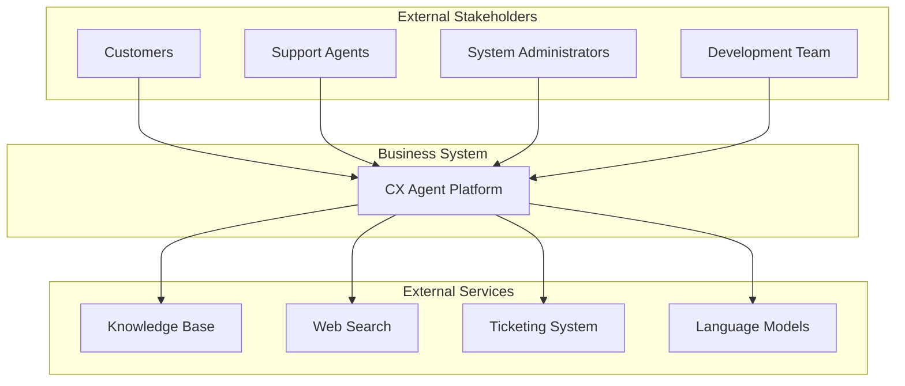

# Business Overview

## Business Context Diagram

## Business Description

**Business Description**: The Agentic AI Customer Experience Platform is an intelligent customer service solution that provides automated, conversational support to customers through an AI-powered agent. The system leverages generative AI, knowledge bases, and external integrations to deliver accurate, contextual responses while maintaining safety and observability standards.

**Core Business Value**: 
- Reduces customer service response times through instant AI-powered assistance
- Scales customer support capabilities without proportional increase in human agents
- Maintains consistent service quality through guardrails and knowledge base integration
- Provides comprehensive observability for continuous improvement

## Business Transactions

### 1. Customer Inquiry Resolution
**Description**: A customer submits a question or request through the chat interface, and the AI agent provides an intelligent response using available knowledge sources.
**Flow**: Customer Input → Content Safety Check → Knowledge Retrieval → AI Response Generation → Response Safety Check → Customer Response
**Business Value**: Instant, accurate customer support with reduced wait times

### 2. Support Ticket Creation
**Description**: When the AI agent cannot resolve an issue or the customer requests human assistance, a support ticket is automatically created in the ticketing system.
**Flow**: Customer Request → Agent Assessment → Ticket Creation → Confirmation to Customer
**Business Value**: Seamless escalation to human agents with complete context preservation

### 3. Knowledge Base Search
**Description**: The agent searches internal company documentation and knowledge bases to provide accurate, company-specific information.
**Flow**: Query Processing → Knowledge Base Retrieval → Relevance Scoring → Citation Generation
**Business Value**: Consistent, up-to-date information delivery based on official company resources

### 4. Web Information Retrieval
**Description**: For queries requiring current information not available in the knowledge base, the agent searches the web for relevant information.
**Flow**: Query Analysis → Web Search → Result Processing → Source Attribution
**Business Value**: Access to current, external information when internal resources are insufficient

### 5. Conversation Management
**Description**: The system maintains conversation context across multiple interactions, enabling natural, coherent multi-turn conversations.
**Flow**: Message Receipt → Context Retrieval → Response Generation → Context Update
**Business Value**: Natural conversation experience that remembers previous interactions

### 6. User Feedback Collection
**Description**: The system collects user feedback on AI responses to continuously improve service quality.
**Flow**: Response Delivery → Feedback Request → Feedback Collection → Analytics Integration
**Business Value**: Continuous improvement through user satisfaction measurement

### 7. Content Safety Enforcement
**Description**: All user inputs and AI responses are checked against safety guardrails to prevent harmful or inappropriate content.
**Flow**: Content Input → Guardrail Assessment → Content Approval/Blocking → Logging
**Business Value**: Safe, compliant customer interactions that protect brand reputation

## Business Dictionary

- **Agent**: The AI-powered conversational system that interacts with customers
- **Conversation**: A series of message exchanges between a customer and the agent
- **Guardrails**: Safety mechanisms that filter inappropriate or harmful content
- **Knowledge Base**: Internal repository of company information and documentation
- **Citation**: Reference to the source of information used in agent responses
- **Tool**: External service or capability the agent can use (search, ticketing, etc.)
- **Trace**: Detailed log of agent processing steps for observability
- **Session**: A continuous interaction period between a user and the agent
- **Feedback**: User evaluation of agent response quality (thumbs up/down with comments)
- **Memory**: System capability to remember conversation history across sessions

## Component Level Business Descriptions

### CX Agent Backend
- **Purpose**: Core AI agent processing engine that handles customer conversations and orchestrates responses
- **Responsibilities**: 
  - Process customer messages through AI models
  - Integrate with knowledge bases and external services
  - Enforce content safety through guardrails
  - Maintain conversation context and history
  - Generate intelligent, contextual responses

### CX Agent Frontend  
- **Purpose**: User-facing chat interface that enables customers to interact with the AI agent
- **Responsibilities**:
  - Provide intuitive chat interface for customer interactions
  - Support both local development and cloud deployment modes
  - Collect and submit user feedback on agent responses
  - Display conversation history and agent capabilities
  - Handle authentication for secure access

### Infrastructure
- **Purpose**: Cloud infrastructure that hosts and scales the AI agent platform on AWS
- **Responsibilities**:
  - Deploy and manage AI agent runtime on AWS Bedrock AgentCore
  - Provision knowledge bases, guardrails, and authentication services
  - Configure observability and monitoring capabilities
  - Manage secrets, parameters, and security configurations
  - Enable scalable, production-ready deployment