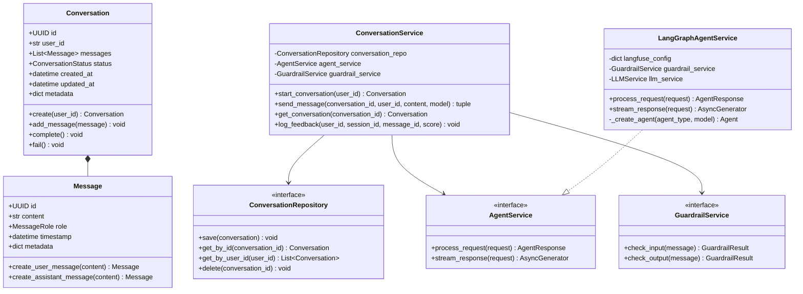

# Code Structure

## Build System

### Backend (cx-agent-backend)
- **Type**: uv (Python package manager)
- **Configuration**: pyproject.toml with hatchling build backend
- **Key Settings**:
  - Python 3.11+ requirement
  - Production dependencies: FastAPI, LangGraph, LangChain, AWS SDK, Pydantic
  - Development dependencies: pytest, mypy, ruff for testing and code quality
  - Strict type checking enabled via mypy

### Frontend (cx-agent-frontend)  
- **Type**: uv (Python package manager)
- **Configuration**: pyproject.toml with hatchling build backend
- **Key Settings**:
  - Python 3.11+ requirement
  - Streamlit-based web application
  - Minimal dependencies: Streamlit, requests, pydantic, boto3

### Infrastructure (infra)
- **Type**: Terraform
- **Configuration**: HCL-based infrastructure as code
- **Key Settings**:
  - Modular architecture with reusable components
  - S3 backend for state management
  - AWS provider with regional deployment support

## Key Classes/Modules



## Design Patterns

### Clean Architecture Pattern
- **Location**: Throughout cx-agent-backend
- **Purpose**: Separate business logic from infrastructure concerns
- **Implementation**: 
  - Domain layer contains entities and business rules
  - Infrastructure layer handles external integrations
  - Presentation layer manages API contracts
  - Dependency inversion through interfaces/ports

### Repository Pattern
- **Location**: domain/repositories and infrastructure/adapters
- **Purpose**: Abstract data access and enable testability
- **Implementation**: 
  - Abstract repository interfaces in domain layer
  - Concrete implementations in infrastructure layer
  - Currently uses in-memory storage, easily swappable for databases

### Dependency Injection Pattern
- **Location**: infrastructure/config/container.py
- **Purpose**: Manage service lifecycles and enable loose coupling
- **Implementation**: 
  - Uses dependency-injector library
  - Singleton and Factory providers for different service types
  - Automatic wiring of dependencies across layers

### Adapter Pattern
- **Location**: infrastructure/adapters/
- **Purpose**: Integrate external services with consistent internal interfaces
- **Implementation**: 
  - LangGraphAgentService adapts LangGraph to AgentService interface
  - BedrockGuardrailService adapts AWS Guardrails to GuardrailService interface
  - OpenAILLMService adapts OpenAI API to LLMService interface

### Strategy Pattern
- **Location**: Frontend client selection, backend service implementations
- **Purpose**: Enable runtime selection of algorithms/implementations
- **Implementation**: 
  - Frontend switches between ConversationClient and AgentCoreClient
  - Backend uses different implementations based on configuration

### Factory Pattern
- **Location**: Message creation, agent creation
- **Purpose**: Encapsulate object creation logic
- **Implementation**: 
  - Message.create_user_message() and Message.create_assistant_message()
  - LangGraphAgentService._create_agent() for agent instantiation

### Observer Pattern (Implicit)
- **Location**: Streamlit frontend, Langfuse observability
- **Purpose**: React to state changes and events
- **Implementation**: 
  - Streamlit's reactive UI updates on state changes
  - Langfuse traces observe agent execution events

## Critical Dependencies

### FastAPI (>=0.104.0)
- **Version**: 0.104.0+
- **Usage**: REST API framework for backend services
- **Purpose**: Provide HTTP endpoints for agent interaction
- **Implementation**: Used in presentation layer for API routing and validation

### LangGraph (>=0.1.0)
- **Version**: 0.1.0+
- **Usage**: Agent orchestration and workflow management
- **Purpose**: Coordinate multi-step agent reasoning and tool usage
- **Implementation**: Core agent processing engine with ReAct pattern

### LangChain (>=0.1.0)
- **Version**: 1.0.0+
- **Usage**: LLM integration and tool management
- **Purpose**: Provide abstractions for LLM interactions and tool calling
- **Implementation**: Message handling, tool definitions, and LLM clients

### Bedrock AgentCore (>=1.0.3)
- **Version**: 1.0.3+
- **Usage**: AWS managed agent runtime and memory services
- **Purpose**: Production deployment platform and conversation memory
- **Implementation**: Runtime hosting and persistent memory storage

### Pydantic (>=2.5.0)
- **Version**: 2.5.0+
- **Usage**: Data validation and serialization
- **Purpose**: Type-safe data models and API schema validation
- **Implementation**: Domain entities, API schemas, and configuration models

### Streamlit (>=1.28.0)
- **Version**: 1.28.0+
- **Usage**: Web UI framework for frontend application
- **Purpose**: Provide interactive chat interface for users
- **Implementation**: Complete frontend application with session management

### Boto3 (>=1.34.0)
- **Version**: 1.34.0+
- **Usage**: AWS SDK for Python
- **Purpose**: Integrate with AWS services (Secrets Manager, Parameter Store, etc.)
- **Implementation**: AWS service clients and resource management

### Dependency Injector (>=4.41.0)
- **Version**: 4.41.0+
- **Usage**: Dependency injection container
- **Purpose**: Manage service lifecycles and dependencies
- **Implementation**: Container configuration and automatic wiring

### Langfuse (>=2.0.0)
- **Version**: 2.0.0+
- **Usage**: Observability and tracing platform
- **Purpose**: Monitor agent performance and collect analytics
- **Implementation**: Trace collection, feedback logging, and performance metrics

### Structlog (>=23.2.0)
- **Version**: 23.2.0+
- **Usage**: Structured logging library
- **Purpose**: Provide consistent, structured application logging
- **Implementation**: JSON-formatted logs with contextual information

## Package Structure Analysis

### Backend Package (cx-agent-backend)
```
cx_agent_backend/
├── domain/                    # Business logic layer
│   ├── entities/             # Core business objects
│   ├── ports/                # Interface definitions
│   ├── repositories/         # Data access interfaces
│   └── services/             # Business logic services
├── infrastructure/           # External integrations
│   ├── adapters/            # Service implementations
│   ├── aws/                 # AWS service clients
│   └── config/              # Configuration management
└── presentation/            # API layer
    ├── api/                 # REST endpoints
    └── schemas/             # Request/response models
```

### Frontend Package (cx-agent-frontend)
```
src/
├── components/              # UI components
├── models/                  # Data models
└── services/               # Backend communication
```

### Infrastructure Package (infra)
```
infra/
├── modules/                 # Reusable Terraform modules
├── main.tf                  # Main infrastructure definition
├── variables.tf             # Input variables
└── outputs.tf              # Output values
```

## Code Quality Indicators

### Type Safety
- **Backend**: Strict mypy configuration with 100% type coverage
- **Frontend**: Basic type hints with Pydantic models
- **Infrastructure**: HCL type constraints and validation

### Code Style
- **Backend**: Ruff linter with 88-character line length
- **Frontend**: Ruff linter with consistent formatting
- **Infrastructure**: Terraform formatting with consistent style

### Testing Structure
- **Backend**: pytest framework with async support
- **Frontend**: No explicit test framework configured
- **Infrastructure**: No explicit testing framework (manual validation)

### Documentation
- **Backend**: Comprehensive docstrings and type hints
- **Frontend**: Basic docstrings and comments
- **Infrastructure**: Inline comments and variable descriptions