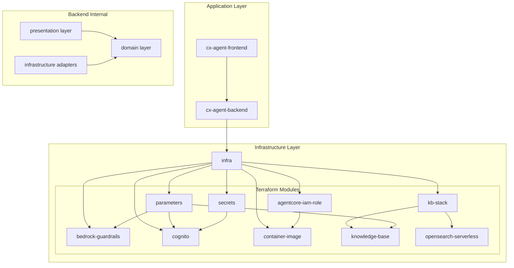

# Dependencies

## Internal Dependencies

### Frontend → Backend
- **Type**: Runtime
- **Reason**: Frontend communicates with backend via HTTP API for agent interactions

### Backend → Infrastructure
- **Type**: Runtime
- **Reason**: Backend requires AWS services provisioned by infrastructure for operation

### Infrastructure Module Dependencies

#### infra → agentcore-iam-role
- **Type**: Compile
- **Reason**: Main infrastructure requires IAM role for AgentCore runtime deployment

#### infra → bedrock-guardrails
- **Type**: Compile
- **Reason**: Main infrastructure creates guardrails for content safety enforcement

#### infra → cognito
- **Type**: Compile
- **Reason**: Main infrastructure requires user authentication services

#### infra → container-image
- **Type**: Compile
- **Reason**: Main infrastructure needs container registry and image for deployment

#### infra → kb-stack
- **Type**: Compile
- **Reason**: Main infrastructure requires knowledge base for agent functionality

#### infra → parameters
- **Type**: Compile
- **Reason**: Main infrastructure needs parameter store for configuration management

#### infra → secrets
- **Type**: Compile
- **Reason**: Main infrastructure requires secrets management for sensitive data

#### kb-stack → knowledge-base
- **Type**: Compile
- **Reason**: Knowledge base stack depends on Bedrock Knowledge Base module

#### kb-stack → opensearch-serverless
- **Type**: Compile
- **Reason**: Knowledge base stack requires OpenSearch for vector search capabilities

#### agentcore-iam-role → container-image
- **Type**: Compile
- **Reason**: IAM role needs ECR repository ARN for container access permissions

#### parameters → knowledge-base + guardrails + cognito
- **Type**: Compile
- **Reason**: Parameter store module needs resource IDs from other modules for configuration

#### secrets → cognito
- **Type**: Compile
- **Reason**: Secrets module needs Cognito client secret for secure storage

### Backend Internal Dependencies

#### presentation → domain
- **Type**: Compile
- **Reason**: Presentation layer uses domain entities and services for business logic

#### infrastructure/adapters → domain
- **Type**: Compile
- **Reason**: Infrastructure adapters implement domain interfaces and use domain entities

## External Dependencies

### Backend Dependencies (cx-agent-backend)

#### aws-opentelemetry-distro (>=0.1.0)
- **Version**: 0.1.0+
- **Purpose**: Distributed tracing and observability integration with AWS services
- **License**: Apache 2.0

#### bedrock-agentcore (>=1.0.3)
- **Version**: 1.0.3+
- **Purpose**: AWS Bedrock AgentCore SDK for memory and runtime integration
- **License**: Apache 2.0

#### boto3 (>=1.34.0)
- **Version**: 1.34.0+
- **Purpose**: AWS SDK for Python - access to AWS services (S3, Secrets Manager, Parameter Store)
- **License**: Apache 2.0

#### dependency-injector (>=4.41.0)
- **Version**: 4.41.0+
- **Purpose**: Dependency injection container for service lifecycle management
- **License**: BSD 3-Clause

#### fastapi (>=0.104.0)
- **Version**: 0.104.0+
- **Purpose**: High-performance async web framework for REST API development
- **License**: MIT

#### langchain (>=0.1.0)
- **Version**: 1.0.0+
- **Purpose**: LLM integration framework with abstractions for models and tools
- **License**: MIT

#### langchain-aws (>=0.1.0)
- **Version**: 0.1.0+
- **Purpose**: AWS-specific integrations for LangChain (Bedrock, Knowledge Base)
- **License**: MIT

#### langchain-core (>=0.1.0)
- **Version**: 0.1.0+
- **Purpose**: Core LangChain abstractions and base classes
- **License**: MIT

#### langchain-openai (>=0.1.0)
- **Version**: 0.1.0+
- **Purpose**: OpenAI integration for LangChain (ChatOpenAI client)
- **License**: MIT

#### langfuse (>=2.0.0)
- **Version**: 2.0.0+
- **Purpose**: Observability and tracing platform for LLM applications
- **License**: MIT

#### langgraph (>=0.1.0)
- **Version**: 0.1.0+
- **Purpose**: Agent orchestration framework for multi-step reasoning workflows
- **License**: MIT

#### pydantic (>=2.5.0)
- **Version**: 2.5.0+
- **Purpose**: Data validation and serialization with type safety
- **License**: MIT

#### pydantic-settings (>=2.1.0)
- **Version**: 2.1.0+
- **Purpose**: Settings management using Pydantic models
- **License**: MIT

#### structlog (>=23.2.0)
- **Version**: 23.2.0+
- **Purpose**: Structured logging with JSON output and contextual information
- **License**: MIT/Apache 2.0

#### tavily-python (>=0.3.0)
- **Version**: 0.3.0+
- **Purpose**: Web search API client for current information retrieval
- **License**: MIT

#### uvicorn[standard] (>=0.24.0)
- **Version**: 0.24.0+
- **Purpose**: ASGI server for FastAPI applications with standard extras
- **License**: BSD 3-Clause

### Frontend Dependencies (cx-agent-frontend)

#### streamlit (>=1.28.0)
- **Version**: 1.28.0+
- **Purpose**: Web application framework for interactive chat interface
- **License**: Apache 2.0

#### requests (>=2.31.0)
- **Version**: 2.31.0+
- **Purpose**: HTTP client library for backend API communication
- **License**: Apache 2.0

#### pydantic (>=2.5.0)
- **Version**: 2.5.0+
- **Purpose**: Data validation and type safety for message models
- **License**: MIT

#### boto3 (>=1.34.0)
- **Version**: 1.34.0+
- **Purpose**: AWS SDK for potential direct AWS service integration
- **License**: Apache 2.0

### Development Dependencies

#### Backend Development
- **httpx** (>=0.25.0) - HTTP client for testing API endpoints
- **ipykernel** (>=6.30.1) - Jupyter notebook kernel for development
- **mypy** (>=1.7.0) - Static type checking for Python code
- **pytest** (>=7.4.0) - Testing framework for unit and integration tests
- **pytest-asyncio** (>=0.21.0) - Async testing support for FastAPI
- **ruff** (>=0.1.0) - Fast Python linter and code formatter

#### Frontend Development
- **ruff** (>=0.1.0) - Python linter and formatter
- **mypy** (>=1.7.0) - Static type checking

### Infrastructure Dependencies

#### Terraform Providers
- **AWS Provider** - Latest - Terraform provider for AWS resource management
- **Random Provider** - Latest - Random value generation for unique resource names
- **Archive Provider** - Latest - File archiving for Lambda deployments

#### External Services
- **LiteLLM Gateway** - External deployment - Multi-provider AI model gateway
- **Langfuse Platform** - External/self-hosted - Observability and analytics platform
- **Tavily API** - External service - Web search capabilities
- **Zendesk API** - External service - Customer support ticketing system

## Dependency Analysis

### Critical Path Dependencies
1. **AWS Bedrock Services** - Core functionality depends on Bedrock models, guardrails, and knowledge base
2. **LangGraph/LangChain** - Agent orchestration and LLM integration are fundamental to operation
3. **FastAPI/Pydantic** - API framework and data validation are essential for service operation
4. **Terraform** - Infrastructure provisioning is required for cloud deployment

### Optional Dependencies
1. **Tavily** - Web search functionality (graceful degradation with mock responses)
2. **Zendesk** - Ticketing integration (mock responses when not configured)
3. **Langfuse** - Observability (can be disabled, reduces monitoring capabilities)

### Security-Critical Dependencies
1. **AWS Cognito** - User authentication and authorization
2. **AWS Secrets Manager** - Secure credential storage
3. **Bedrock Guardrails** - Content safety enforcement
4. **Pydantic** - Input validation and data sanitization

### Performance-Critical Dependencies
1. **OpenSearch Serverless** - Vector search performance for knowledge retrieval
2. **AgentCore Memory** - Conversation context retrieval speed
3. **LiteLLM Gateway** - Model response latency and throughput
4. **FastAPI** - API response times and concurrent request handling

### Licensing Compatibility
- **Permissive Licenses**: MIT, Apache 2.0, BSD - Compatible with commercial use
- **No Copyleft Dependencies**: All dependencies use permissive licenses
- **Commercial Deployment**: No licensing restrictions for commercial deployment