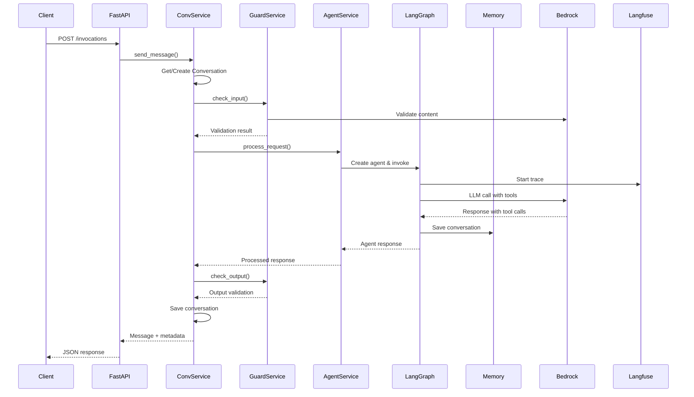
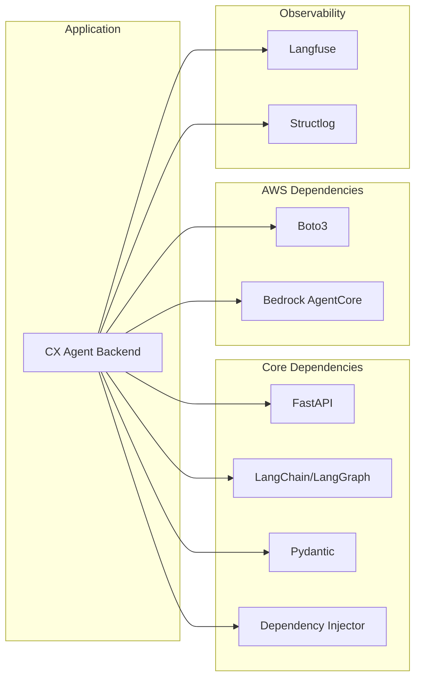

# CX Agent Backend Architecture

## Clean Architecture Overview

```mermaid
graph TB
    subgraph "External Systems"
        Client[Client Applications]
        AgentCore[AWS Bedrock AgentCore]
        Bedrock[AWS Bedrock LLM]
        Guardrails[AWS Bedrock Guardrails]
        Memory[AgentCore Memory]
        Langfuse[Langfuse Observability]
        Secrets[AWS Secrets Manager]
        Params[AWS Parameter Store]
    end

    subgraph "Presentation Layer"
        FastAPI[FastAPI Application]
        Router[Conversation Router]
        Schemas[Pydantic Schemas]
    end

    subgraph "Domain Layer"
        subgraph "Entities"
            Conversation[Conversation Entity]
            Message[Message Entity]
        end
        
        subgraph "Services (Interfaces)"
            ConvService[ConversationService]
            AgentService[AgentService]
            GuardService[GuardrailService]
            LLMService[LLMService]
        end
        
        subgraph "Repositories (Interfaces)"
            ConvRepo[ConversationRepository]
        end
    end

    subgraph "Infrastructure Layer"
        subgraph "Adapters"
            LangGraph[LangGraphAgentService]
            BedrockGuard[BedrockGuardrailService]
            OpenAILLM[OpenAILLMService]
            MemoryRepo[MemoryConversationRepository]
        end
        
        subgraph "Configuration"
            Container[DI Container]
            Settings[Application Settings]
        end
        
        subgraph "AWS Integrations"
            SecretReader[AWSSecretsReader]
            ParamReader[AWSParameterStoreReader]
        end
    end

    %% External connections
    Client --> FastAPI
    AgentCore --> FastAPI
    
    %% Presentation to Domain
    FastAPI --> Router
    Router --> Schemas
    Router --> ConvService
    
    %% Domain relationships
    ConvService --> AgentService
    ConvService --> GuardService
    ConvService --> ConvRepo
    ConvService --> Conversation
    ConvService --> Message
    
    %% Infrastructure implementations
    AgentService -.-> LangGraph
    GuardService -.-> BedrockGuard
    LLMService -.-> OpenAILLM
    ConvRepo -.-> MemoryRepo
    
    %% Configuration
    Container --> Settings
    Container --> SecretReader
    Container --> ParamReader
    
    %% External service connections
    LangGraph --> Bedrock
    LangGraph --> Memory
    LangGraph --> Langfuse
    BedrockGuard --> Guardrails
    OpenAILLM --> Bedrock
    SecretReader --> Secrets
    ParamReader --> Params

    classDef domain fill:#e1f5fe
    classDef infrastructure fill:#f3e5f5
    classDef presentation fill:#e8f5e8
    classDef external fill:#fff3e0

    class Conversation,Message,ConvService,AgentService,GuardService,LLMService,ConvRepo domain
    class LangGraph,BedrockGuard,OpenAILLM,MemoryRepo,Container,Settings,SecretReader,ParamReader infrastructure
    class FastAPI,Router,Schemas presentation
    class Client,AgentCore,Bedrock,Guardrails,Memory,Langfuse,Secrets,Params external
```

## Request Flow Diagram

## Component Dependencies

## Key Design Patterns

### 1. **Clean Architecture**
- **Domain** layer contains business logic and entities
- **Infrastructure** layer handles external concerns
- **Presentation** layer manages API contracts
- Dependencies point inward (Dependency Inversion)

### 2. **Dependency Injection**
- Container manages all service lifecycles
- Interfaces defined in domain, implementations in infrastructure
- Easy testing and swapping of implementations

### 3. **Repository Pattern**
- Abstract data access through interfaces
- Current implementation uses in-memory storage
- Can be easily swapped for database persistence

### 4. **Service Layer**
- Business logic encapsulated in services
- Clear separation between conversation management and agent processing
- Composable and testable components

### 5. **Adapter Pattern**
- External services wrapped in domain-specific adapters
- LangGraph, Bedrock, and other AWS services abstracted
- Consistent internal interfaces regardless of external changes