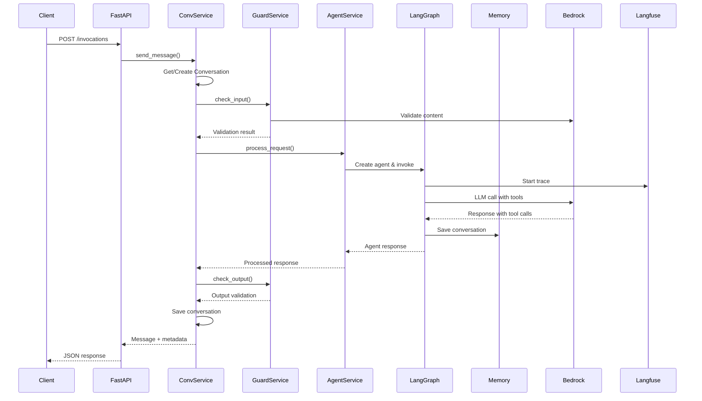
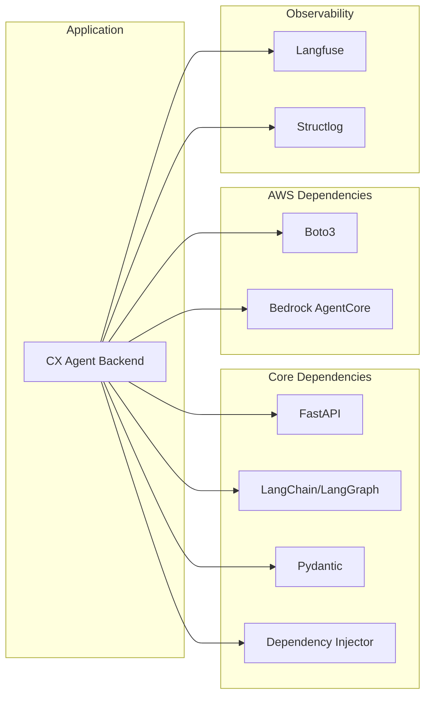

# CX Agent Backend Architecture

## Directory Structure Analysis

```
cx-agent-backend/
├── cx_agent_backend/
│   ├── __init__.py                    # Package initialization & logging config
│   ├── __main__.py                    # Application entry point
│   ├── server.py                      # FastAPI application factory
│   │
│   ├── domain/                        # Domain Layer (Business Logic)
│   │   ├── entities/
│   │   │   └── conversation.py        # Core business entities
│   │   ├── repositories/
│   │   │   └── conversation_repository.py  # Data access interfaces
│   │   └── services/
│   │       ├── conversation_service.py     # Business logic orchestration
│   │       ├── agent_service.py           # Agent processing interface
│   │       ├── guardrail_service.py       # Content safety interface
│   │       └── llm_service.py             # LLM communication interface
│   │
│   ├── infrastructure/                # Infrastructure Layer (External Concerns)
│   │   ├── adapters/
│   │   │   ├── langgraph_agent_service.py      # LangGraph implementation
│   │   │   ├── bedrock_guardrail_service.py    # AWS Guardrails implementation
│   │   │   ├── openai_llm_service.py           # OpenAI-compatible LLM client
│   │   │   ├── memory_conversation_repository.py # In-memory data storage
│   │   │   └── tools/                          # Agent tools (KB, web search, etc.)
│   │   ├── config/
│   │   │   ├── settings.py            # Application configuration
│   │   │   └── container.py           # Dependency injection setup
│   │   └── aws/
│   │       ├── secret_reader.py       # AWS Secrets Manager client
│   │       └── parameter_store_reader.py # AWS Parameter Store client
│   │
│   └── presentation/                  # Presentation Layer (API Interface)
│       ├── api/
│       │   └── conversation_router.py # REST API endpoints
│       └── schemas/
│           └── conversation_schemas.py # Request/response models
│
├── pyproject.toml                     # Project dependencies & build config
├── uv.lock                           # Dependency lock file
└── Dockerfile                        # Container configuration
```

### **Layer-by-Layer Analysis**

#### **Domain Layer** (`domain/`)
**Purpose**: Contains pure business logic, independent of external frameworks

**Entities** (`entities/`):
- `conversation.py`: Core business objects (Conversation, Message, enums)
- Immutable value objects with business rules
- No external dependencies

**Repositories** (`repositories/`):
- `conversation_repository.py`: Abstract data access interface
- Defines contracts without implementation details
- Enables dependency inversion

**Services** (`services/`):
- `conversation_service.py`: Orchestrates business workflows
- `agent_service.py`: Abstract agent processing interface
- `guardrail_service.py`: Content safety validation interface
- `llm_service.py`: Language model communication interface

#### **Infrastructure Layer** (`infrastructure/`)
**Purpose**: Handles external system integrations and technical concerns

**Adapters** (`adapters/`):
- `langgraph_agent_service.py`: LangGraph-based agent implementation
- `bedrock_guardrail_service.py`: AWS Bedrock Guardrails integration
- `openai_llm_service.py`: OpenAI-compatible API client
- `memory_conversation_repository.py`: In-memory storage implementation
- `tools/`: Agent tools for knowledge base, web search, ticketing

**Configuration** (`config/`):
- `settings.py`: Pydantic-based configuration management
- `container.py`: Dependency injection container setup

**AWS Integrations** (`aws/`):
- `secret_reader.py`: AWS Secrets Manager integration
- `parameter_store_reader.py`: AWS Parameter Store integration

#### **Presentation Layer** (`presentation/`)
**Purpose**: Handles HTTP API concerns and external communication

**API** (`api/`):
- `conversation_router.py`: FastAPI route definitions
- HTTP request/response handling
- Dependency injection integration

**Schemas** (`schemas/`):
- `conversation_schemas.py`: Pydantic models for API contracts
- Request/response validation
- OpenAPI documentation generation

### **Architectural Principles Demonstrated**

#### **1. Dependency Inversion Principle**
```
Domain (interfaces) ← Infrastructure (implementations)
```
- Domain defines interfaces, infrastructure implements them
- Business logic doesn't depend on external frameworks

#### **2. Single Responsibility Principle**
- Each module has one clear purpose
- Services handle specific business concerns
- Adapters handle specific external integrations

#### **3. Open/Closed Principle**
- Easy to add new implementations (new LLM providers, storage backends)
- Core business logic remains unchanged when adding features

#### **4. Interface Segregation**
- Small, focused interfaces (AgentService, GuardrailService, etc.)
- Clients depend only on methods they use

### **File Organization Benefits**

#### **Maintainability**
- Clear separation makes code easy to locate and modify
- Changes to external systems isolated to infrastructure layer
- Business logic changes isolated to domain layer

#### **Testability**
- Domain layer can be tested without external dependencies
- Infrastructure adapters can be mocked easily
- Clear boundaries enable focused unit testing

#### **Scalability**
- Easy to swap implementations (memory → database storage)
- New features added without modifying existing code
- Microservice extraction possible along layer boundaries

## Clean Architecture Overview

```mermaid
graph TB
    subgraph "External Systems"
        Client[Client Applications]
        AgentCore[AWS Bedrock AgentCore]
        Bedrock[AWS Bedrock LLM]
        Guardrails[AWS Bedrock Guardrails]
        Memory[AgentCore Memory]
        Langfuse[Langfuse Observability]
        Secrets[AWS Secrets Manager]
        Params[AWS Parameter Store]
    end

    subgraph "Presentation Layer"
        FastAPI[FastAPI Application]
        Router[Conversation Router]
        Schemas[Pydantic Schemas]
    end

    subgraph "Domain Layer"
        subgraph "Entities"
            Conversation[Conversation Entity]
            Message[Message Entity]
        end
        
        subgraph "Services (Interfaces)"
            ConvService[ConversationService]
            AgentService[AgentService]
            GuardService[GuardrailService]
            LLMService[LLMService]
        end
        
        subgraph "Repositories (Interfaces)"
            ConvRepo[ConversationRepository]
        end
    end

    subgraph "Infrastructure Layer"
        subgraph "Adapters"
            LangGraph[LangGraphAgentService]
            BedrockGuard[BedrockGuardrailService]
            OpenAILLM[OpenAILLMService]
            MemoryRepo[MemoryConversationRepository]
        end
        
        subgraph "Configuration"
            Container[DI Container]
            Settings[Application Settings]
        end
        
        subgraph "AWS Integrations"
            SecretReader[AWSSecretsReader]
            ParamReader[AWSParameterStoreReader]
        end
    end

    %% External connections
    Client --> FastAPI
    AgentCore --> FastAPI
    
    %% Presentation to Domain
    FastAPI --> Router
    Router --> Schemas
    Router --> ConvService
    
    %% Domain relationships
    ConvService --> AgentService
    ConvService --> GuardService
    ConvService --> ConvRepo
    ConvService --> Conversation
    ConvService --> Message
    
    %% Infrastructure implementations
    AgentService -.-> LangGraph
    GuardService -.-> BedrockGuard
    LLMService -.-> OpenAILLM
    ConvRepo -.-> MemoryRepo
    
    %% Configuration
    Container --> Settings
    Container --> SecretReader
    Container --> ParamReader
    
    %% External service connections
    LangGraph --> Bedrock
    LangGraph --> Memory
    LangGraph --> Langfuse
    BedrockGuard --> Guardrails
    OpenAILLM --> Bedrock
    SecretReader --> Secrets
    ParamReader --> Params

    classDef domain fill:#e1f5fe
    classDef infrastructure fill:#f3e5f5
    classDef presentation fill:#e8f5e8
    classDef external fill:#fff3e0

    class Conversation,Message,ConvService,AgentService,GuardService,LLMService,ConvRepo domain
    class LangGraph,BedrockGuard,OpenAILLM,MemoryRepo,Container,Settings,SecretReader,ParamReader infrastructure
    class FastAPI,Router,Schemas presentation
    class Client,AgentCore,Bedrock,Guardrails,Memory,Langfuse,Secrets,Params external
```



## Request Flow Diagram



## Component Dependencies



## Key Design Patterns

### 1. **Clean Architecture**
- **Domain** layer contains business logic and entities
- **Infrastructure** layer handles external concerns
- **Presentation** layer manages API contracts
- Dependencies point inward (Dependency Inversion)

### 2. **Dependency Injection**
- Container manages all service lifecycles
- Interfaces defined in domain, implementations in infrastructure
- Easy testing and swapping of implementations

### 3. **Repository Pattern**
- Abstract data access through interfaces
- Current implementation uses in-memory storage
- Can be easily swapped for database persistence

### 4. **Service Layer**
- Business logic encapsulated in services
- Clear separation between conversation management and agent processing
- Composable and testable components

### 5. **Adapter Pattern**
- External services wrapped in domain-specific adapters
- LangGraph, Bedrock, and other AWS services abstracted
- Consistent internal interfaces regardless of external changes