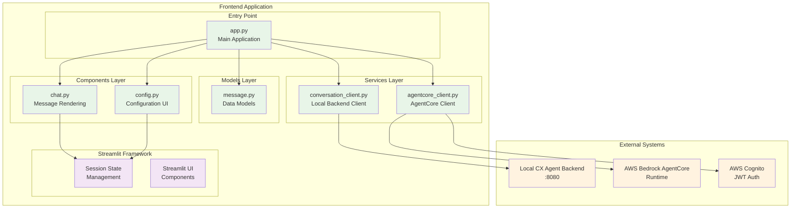
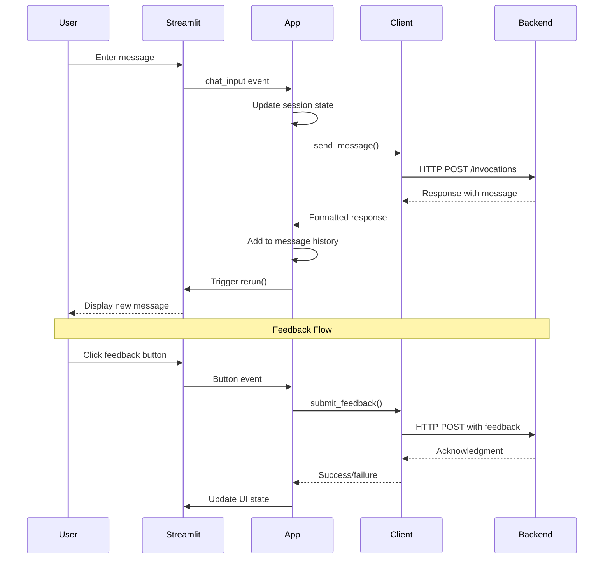

# CX Agent Frontend Architecture Analysis

## Overview

The cx-agent-frontend is a **Streamlit-based web application** that provides a clean, interactive chat interface for the CX Agent system. It supports dual backend connectivity - both local backend and AWS Bedrock AgentCore Runtime.

## Architecture Pattern: **Component-Based Streamlit Application**



## Directory Structure Analysis

```
cx-agent-frontend/
├── src/
│   ├── app.py                    # Main application entry point
│   ├── components/               # UI Components
│   │   ├── chat.py              # Chat interface & message rendering
│   │   └── config.py            # Configuration forms
│   ├── models/                   # Data Models
│   │   └── message.py           # Message data structure
│   └── services/                 # Backend Communication
│       ├── conversation_client.py # Local backend client
│       └── agentcore_client.py   # AWS AgentCore client
├── pyproject.toml               # Dependencies & build config
└── Dockerfile                   # Container configuration
```

## Component Analysis

### **1. Application Layer (`app.py`)**

**Responsibilities:**
- Application initialization and configuration
- Session state management
- Main chat loop orchestration
- Client selection logic (local vs AgentCore)

**Key Features:**
- Dual backend support with runtime switching
- Session state persistence across interactions
- Responsive UI with custom CSS styling
- Conversation management with UUID generation

**Architecture Pattern:** **Controller Pattern**
- Coordinates between UI components and services
- Manages application state and flow control

### **2. Components Layer**

#### **Chat Component (`chat.py`)**
**Responsibilities:**
- Message rendering with role-based styling
- Interactive feedback collection (👍/👎)
- Citation display from knowledge base
- Tool usage visualization
- Metadata expansion for debugging

**Key Features:**
- Feedback submission with optional comments
- Source citation display with relevance scores
- Tool call visualization
- Expandable message details

#### **Config Component (`config.py`)**
**Responsibilities:**
- Backend selection (Local vs AgentCore)
- AgentCore configuration (ARN, region, auth)
- Configuration validation
- User preference management

**Key Features:**
- Toggle between backend types
- JWT token management for AgentCore
- Region selection for AWS services
- Real-time configuration validation

### **3. Models Layer (`message.py`)**

**Data Structure:**
```python
class Message(BaseModel):
    role: str           # "user" | "assistant"
    content: str        # Message text
    timestamp: datetime # When message was created
    metadata: Dict      # Additional data (tools, citations, etc.)
```

**Design Pattern:** **Value Object**
- Immutable data structure using Pydantic
- Type validation and serialization
- Clean separation of data from behavior

### **4. Services Layer**

#### **Conversation Client (`conversation_client.py`)**
**Responsibilities:**
- HTTP communication with local backend
- Request/response handling for `/invocations` endpoint
- Feedback submission to local backend
- Error handling and user notification

**Communication Pattern:**
```python
# Message sending
POST /invocations
{
  "input": {
    "prompt": "user message",
    "conversation_id": "uuid",
    "model": "bedrock/claude-3-sonnet",
    "user_id": "user_123"
  }
}

# Feedback submission
POST /invocations
{
  "input": {
    "feedback": {
      "run_id": "message_id",
      "session_id": "conversation_id", 
      "score": 1.0,
      "comment": "helpful response"
    }
  }
}
```

#### **AgentCore Client (`agentcore_client.py`)**
**Responsibilities:**
- Direct AWS Bedrock AgentCore Runtime communication
- JWT authentication handling
- Session management with AgentCore
- URL encoding for ARN parameters

**Communication Pattern:**
```python
# AgentCore invocation
POST https://bedrock-agentcore.{region}.amazonaws.com/runtimes/{encoded_arn}/invocations
Headers:
  Authorization: Bearer {jwt_token}
  X-Amzn-Bedrock-AgentCore-Runtime-Session-Id: {session_id}
Body: {
  "input": {
    "prompt": "message",
    "conversation_id": "uuid"
  }
}
```

## Technology Stack Analysis

### **Core Dependencies**
- **Streamlit 1.28+**: Web framework for rapid UI development
- **Requests 2.31+**: HTTP client for backend communication
- **Pydantic 2.5+**: Data validation and serialization
- **Boto3 1.34+**: AWS SDK (for potential future AWS integrations)

### **Development Tools**
- **Ruff**: Fast Python linter and formatter
- **MyPy**: Static type checking
- **Docker**: Containerization with multi-stage builds

## Design Patterns Identified

### **1. Strategy Pattern**
- **Client Selection**: Runtime switching between `ConversationClient` and `AgentCoreClient`
- **Backend Abstraction**: Common interface for different backend types

### **2. State Management Pattern**
- **Streamlit Session State**: Persistent state across page reloads
- **Conversation Continuity**: Message history and conversation ID management

### **3. Component Pattern**
- **Modular UI**: Separate components for chat, config, and rendering
- **Reusable Functions**: `render_message()`, `render_sidebar()`, etc.

### **4. Observer Pattern**
- **Reactive UI**: Streamlit's automatic re-rendering on state changes
- **Real-time Updates**: UI updates based on user interactions

## Data Flow Analysis



## Strengths

### **1. Clean Architecture**
- Clear separation of concerns across layers
- Modular component design for maintainability
- Type safety with Pydantic models

### **2. Dual Backend Support**
- Flexible deployment options (local dev vs production)
- Runtime backend switching without restart
- Consistent interface across different backends

### **3. User Experience**
- Interactive feedback collection
- Real-time configuration validation
- Rich message display with citations and metadata

### **4. Production Ready**
- Docker containerization with security best practices
- Non-root user execution
- Multi-stage builds for optimization

## Areas for Improvement

### **1. Error Handling**
- **Current**: Basic try/catch with Streamlit error display
- **Improvement**: Structured error handling with retry logic and user-friendly messages

### **2. State Management**
- **Current**: Streamlit session state (memory-based)
- **Improvement**: Persistent storage for conversation history

### **3. Authentication**
- **Current**: Manual JWT token input
- **Improvement**: Integrated AWS Cognito authentication flow

### **4. Testing**
- **Current**: No test coverage identified
- **Improvement**: Unit tests for components and integration tests for clients

### **5. Configuration Management**
- **Current**: UI-based configuration only
- **Improvement**: Environment variables and configuration files

## Security Considerations

### **Implemented**
- JWT token handling for AgentCore authentication
- HTTPS communication with AWS services
- Non-root Docker container execution

### **Recommendations**
- Secure token storage (not in session state)
- Input validation and sanitization
- Rate limiting for API calls
- Audit logging for user interactions

## Scalability Considerations

### **Current Limitations**
- Single-user session state (no multi-tenancy)
- In-memory conversation storage
- No caching layer for API responses

### **Scaling Recommendations**
- Database-backed conversation storage
- Redis for session management
- CDN for static assets
- Load balancing for multiple instances

## Conclusion

The cx-agent-frontend demonstrates a **well-structured Streamlit application** with clean separation of concerns and dual backend support. The architecture is suitable for rapid prototyping and development environments, with clear paths for production enhancement through improved state management, authentication, and scalability features.

The component-based design makes it easy to extend functionality, while the service layer abstraction allows for flexible backend integration. The application successfully bridges the gap between local development and cloud-native AWS deployment scenarios.